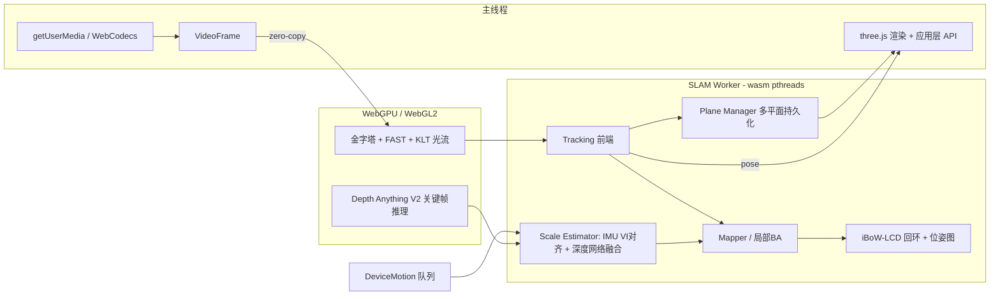

# ArgusAR 改造升级 Roadmap

> 目标：把它升级为一个**生产可用的浏览器端 AR 引擎**——稳健的 SLAM、多平面识别、
> **真实米制尺度**（放一个 1m 的立方体，现实中看起来就是 1m），并用 WASM(SIMD/多线程) + GPU(WebGPU/WebGL2) 榨干浏览器性能。
>
> 基线状态（已完成）：原版构建链已在本机跑通（emsdk 3.1.40），video/camera demo 验证可用。
> 详见 memory: alvaar-build-setup。

---

## 0. 现状与差距

| 能力 | 现状 | 目标 |
|---|---|---|
| SLAM | OV²SLAM 精简版，单线程，无回环，初始化脆弱 | 多线程 + 回环 + 稳健初始化 + 重定位 |
| 平面识别 | 单次 RANSAC，只认水平面，无持久化 | 多平面（水平/垂直/任意）、持久化跟踪、边界估计、hitTest |
| 尺度 | 单目，尺度任意（unitless） | 米制尺度，目标误差 ≤ ±10–15% |
| IMU | 数据被解析后丢弃，仅丢失时用朝向兜底 | 松耦合 VI 对齐估尺度；进阶紧耦合 |
| 性能 | WASM 单线程，依赖库未开 SIMD，4.3MB 单文件 | SIMD + pthreads + GPU 前端，wasm 拆分流式加载 |

## 1. 可利用的开源库盘点

**SLAM 算法参考/移植来源**
| 库 | 许可 | 用途 |
|---|---|---|
| OV²SLAM | GPLv3 | 现有基底；恢复其原版三线程架构（tracking / mapping / loop-closing） |
| ORB-SLAM2 | GPLv3 | 移植其初始化（Homography/Fundamental 双模型自动选择）与重定位逻辑 |
| ORB-SLAM3 | GPLv3 | 参考其视觉-惯性初始化（MAP 估计求尺度+重力方向+bias） |
| VINS-Mono | GPLv3 | 参考其 IMU 预积分与视觉-惯性线性对齐（求尺度的经典做法） |
| iBoW-LCD + OBIndex2 | GPLv3 | 已随库附带、已编译成 wasm，但从未接入——接回环检测 |
| Ceres / Sophus / Eigen / OpenGV | BSD/MIT/MPL2/BSD | 已在用，保留 |

**新引入候选**
| 库 | 许可 | 用途 |
|---|---|---|
| Depth Anything V2 (Small, metric) | Apache-2.0 | 单目米制深度网络，关键帧低频推理辅助定尺度/稠密平面 |
| onnxruntime-web (WebGPU EP) | MIT | 在浏览器跑上面的深度模型 |
| XFeat | Apache-2.0 | 轻量学习型特征（可选实验路线，替代 FAST+BRIEF 前端） |
| three.js | MIT | 示例渲染（已在用） |
| OpenCV.js --simd / --threads | Apache-2.0 | 重编依赖，打开 SIMD/线程 |

> ⚠️ 许可注意：整个项目继承 ORB-SLAM2/OV²SLAM 的 **GPLv3**，衍生发布须开源同协议。
> SuperPoint（MagicLeap）为非商用许可，**不采用**；学习型特征选 Apache-2.0 的 XFeat。

## 2. 总体架构（目标态）

## 3. 分阶段计划

### Phase 1 — 性能地基：SIMD + 构建现代化（AI 运行 ~2–4 小时，主要是全量重编等待）
- `libs/build.sh` 切 `BUILD_TYPE=SIMD` 全量重编（OpenCV 用 `--simd`），主项目保持 `-msimd128`
- 拆掉 `SINGLE_FILE`：`.wasm` 独立文件 + streaming instantiation；开 `-flto`
- SLAM 移入 **Web Worker**（OffscreenCanvas 渲染特征点层），主线程只渲染
- 建立**基准测试页**：ms/帧（分解到提取/跟踪/BA）、初始化成功率、内存曲线——之后每阶段用同一基准回归
- **自适应质量控制器 v1**（从 Phase 5 提前到本阶段，对老机型体验决定性）：按滚动帧耗时动态调整采集分辨率与特征点上限，带迟滞防振荡
- 验收：demo 帧率可量化提升，主线程不再被 SLAM 阻塞

### Phase 2 — 平面识别 v1 ✅ 已完成（2026-08-11）★ 用户可感知的最大升级
- 多平面顺序 RANSAC（检出一个平面→剔除内点→继续），去掉"只认水平面"的限制，按法线分类 horizontal / vertical / arbitrary
- **PlaneManager**：平面跨帧持久化（ID 稳定），新关键帧内点增量精化，位姿 EMA 平滑防抖
- 平面**边界估计**：内点投影到平面 2D 坐标系 → 凸包/alpha-shape → 返回 polygon + extent
- 新 API：`getPlanes()`（多平面+边界+法线+类型）、`hitTest(x, y)`（屏幕射线↔平面求交）、`createAnchor(pose)`
- 验收：桌面 + 地面 + 墙面同时检出且 ID 稳定；虚拟物体经 hitTest 贴放在平面上不漂
- embind 接口从裸指针传参改成结构化（顺手把 4096 点上限的 bug 修掉——`getFramePoints` 循环变量误用 `numPoints*2` 截断逻辑有问题）

### Phase 3 — SLAM 稳健性 ✅ 主体完成（2026-08-11；重定位增强移入 Phase 4 前置）
- **初始化重写**：移植 ORB-SLAM2 的 H/F 双模型评分选择，替换现有脆弱初始化（弱纹理白墙场景实测丢跟踪）
- **回环闭合**：接入已编译的 iBoW-LCD + OBIndex2，回环校验后跑位姿图优化（Ceres 已具备）
- 重定位增强：丢失后用词袋检索关键帧重定位，替代"IMU 朝向兜底"
- 验收：基准视频初始化成功率 >95%；绕室一周回到原点，闭环后轨迹漂移显著收敛

### Phase 4 — 米制尺度 🔶 第一层已交付（2026-08-11：IMU 松耦合尺度+重力，合成验证 0.02% 误差；深度网络与 ArUco 两层待做）★ 技术难点，分三层保险
单目 SLAM 尺度不可观测，必须引入外部度量信息。三条路线叠加，按可用性降级：
1. **IMU 松耦合对齐（默认，无需额外依赖）**
   - DeviceMotion 加速度计（m/s²，60Hz）预积分，与视觉轨迹做 VINS 式线性对齐，联合解尺度 s + 重力方向 + 速度
   - 需要用户初始化时做"前后平移"激励动作（UI 引导）；浏览器 IMU 60Hz + 时间戳抖动是精度上限，预期误差 ±10–20%
2. **深度网络定标（可选增强，设备够强时自动开启）**
   - Depth Anything V2 Small (metric, indoor) 经 onnxruntime-web WebGPU 跑关键帧（低频，每 N 个关键帧一次）
   - 网络米制深度 vs SLAM 点深度做鲁棒中位数比值 → 修正全局尺度，多关键帧滑窗滤波
   - 预期把误差压到 ±5–10%，且无需用户特定动作
3. **已知尺寸标定（精确模式）**
   - 打印 ArUco 码/A4 纸等已知尺寸参照物入镜一次即完成精确定标（误差 <3%）；作为专业用户选项
- 重力方向同时从 IMU 获得 → 场景 Y 轴对齐真实竖直方向（放置物体不歪）
- 验收：放置 1m 虚拟立方体，与卷尺实measured 对比误差 ≤15%（路线1）/ ≤10%（路线1+2）

### Phase 5 — GPU 前端（AI 运行 ~10–16 小时，shader 调试轮次最多；与 Phase 3/4 可并行推进）
- 帧预处理管线 GPU 化：WebGPU compute shader 实现图像金字塔 + FAST 角点 + KLT 光流（前端最大 CPU 热点）
- WebCodecs `VideoFrame` → GPU 纹理零拷贝导入，结果 readback 仅角点/光流小数据
- 降级链：WebGPU → WebGL2 fragment shader → 纯 WASM SIMD（自动检测）
- 实验分支：XFeat ONNX 前端（学习型特征，弱纹理更稳），基准对比后决定是否默认启用
- 验收：前端耗时基准对比 ≥2× 提升，中端手机 30fps 稳定

### Phase 6 — 多线程 + 工程化收尾（AI 运行 ~4–8 小时，含 pthreads 全量重编等待）
- pthreads 重编（libs `BUILD_TYPE=THREADS` + SharedArrayBuffer），恢复 OV²SLAM 原版 tracking/mapping/loop-closing 三线程并行
- 部署要求：服务器需 COOP/COEP 响应头（cross-origin isolation），dev server 与文档配好
- 打包：npm 包（ESM + TS 类型声明）、API 文档、camera/video/尺度标定三个 demo
- 验收：`npm install` 即用；含 SIMD/线程/GPU 特性检测自动降级

## 4. 里程碑与总量（按 AI 运行时间估算）

| 里程碑 | 内容 | AI 运行时间 | 需要用户参与的环节 |
|---|---|---|---|
| M1 | Phase 1+2：性能地基 + 平面系统 | ~5–10 小时 | 手机扫码看平面检测效果（可选） |
| M2 | Phase 3+4：稳健 SLAM + 米制尺度 | ~14–24 小时 | **必需**：真机走动测试回环；卷尺实测 1m 立方体误差；iOS 授权 DeviceMotion |
| M3 | Phase 5+6：GPU + 多线程 + 发布 | ~14–24 小时 | 中端手机跑 GPU 降级链实测 |
| 合计 | | **~33–58 小时** | |

估算口径与瓶颈说明：
- **编译等待占大头**：依赖库全量重编（SIMD/THREADS 各一轮）每轮约 40–60 分钟；主项目增量编译每轮 2–5 分钟，调试期会跑几十轮
- **调试迭代轮次是第二大项**：C++/shader 的"改→编→浏览器验证"循环，Phase 3/5 尤甚
- **人机串行点**：真机实测（回环走动、尺度卷尺验证、iOS 权限）无法由 AI 单独完成，会话会在这些点暂停等你反馈
- 以上为纯运行时间；跨会话上下文恢复、以及等你反馈的间隙不计入

## 5. 主要风险与对策

| 风险 | 对策 |
|---|---|
| 浏览器 IMU 60Hz/时间戳抖动 → 尺度精度不足 | 三层保险设计；深度网络路线不依赖 IMU 质量 |
| iOS Safari：无 WebGPU(旧版)、DeviceMotion 需授权、无 SharedArrayBuffer(旧版) | 全链路特性检测 + 降级；iOS 17+ 已支持 WebGPU/SAB |
| Depth Anything 模型体积（Small ~50MB ONNX） | 量化到 int8（~13MB）+ CDN 缓存 + 可选加载 |
| pthreads 需要 COOP/COEP，第三方托管可能配不了响应头 | Service Worker 注入头的成熟 workaround + 单线程构建双发 |
| 老依赖 + 新 emsdk 兼容性 | 已趟平一轮（cmake4 policy、eigen stub 等），锁定 emsdk 3.1.40 |
| OpenCV 4.5.5 wasm SIMD 内核在新 LLVM 下结果错误（Phase 1 实测：跟踪率归零） | 生产用混合构建（OpenCV 标量+其余 SIMD）；根治=升级 OpenCV ≥4.7 或 Phase 5 GPU 前端直接替掉这些内核 |
| GPLv3 | 商用需整体开源或重谈技术路线（如换 Basalt/BSD 系重写，代价大，默认不做） |

## 6. 设备支持矩阵（2026-08 核实）

| 档位 | 技术路径 | 覆盖设备 | 目标体验 |
|---|---|---|---|
| Tier 1 全功能 | WebGPU + SIMD + 多线程 | iPhone 11+/SE2+（iOS 26），Android 12+ 中高端 | 30fps，全特性 |
| Tier 2 标准 | WebGL2 + SIMD + 多线程 | iPhone 8–XR（iOS 16.4–18），Android 8+ 中端 | 24–30fps |
| Tier 3 保底 | 纯 WASM SIMD 单线程 | 老旧浏览器、微信 XWeb | 降质 15–20fps，保平面+基础跟踪 |
| 不支持 | — | iPhone 7 及更早（无 wasm SIMD）、iOS <16.4、无 WebGL2 | 明确提示，不静默失败 |

- 支持线画在 **2017 年 iPhone 8 / Android 8**，再往前成本收益比急剧恶化
- iPhone 由硬件锁死系统与 Safari 能力（XS/XR 止步 iOS 18 → 永无 WebGPU）；Android 浏览器常青，瓶颈是 SoC 性能，靠自适应降质兜底
- WebGPU 需 Android 12+ 且 GPU 驱动过白名单；低端 Mali/Adreno 可能被 blocklist → 自动落 WebGL2
- **微信内置浏览器**（Android XWeb / iOS WKWebView）行为不可查表，Phase 5/6 需真机实测专项
- wasm 基线特性核实：SIMD128 全绿可硬性依赖；threads 需 COOP/COEP（GitHub Pages 不支持自定义头 → coi-serviceworker 或迁 Cloudflare Pages）；Relaxed SIMD 在 Safari 状态不明，不依赖

## 7. 明确不做（本期）

- 紧耦合 VIO 完整重写（VINS 级后端）——收益/成本比低于松耦合+深度网络组合
- 稠密重建 / mesh 化 / 遮挡（occlusion）——属下一期
- WebXR API 桥接——ArgusAR 的价值恰在 WebXR 不可用的场景（iOS Safari）；仅在 README 说明何时应直接用 WebXR
